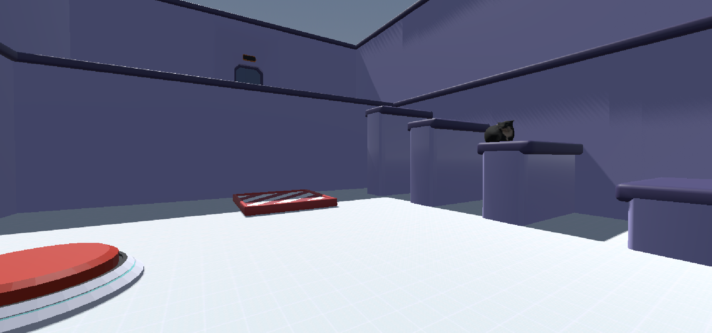

#  🕹️ Purrsh the Button

> ❓ 3D puzzle game, made with Godot the Women Game Jam 2023, under the theme "Switching Perspectives".

    
Screenshot of the game

    <!--  -->

## 📋 Requirements

- [Godot 4.1.1](https://godotengine.org/)

## 📋 Issues

Feel free to open an issue if you find a bug or have a suggestion, so we can discuss the best way to improve or fix it.

## 👋 Contributing

You're always welcome to contribute to this project, just create your pull request, and wait for the review.

## 🫂 Authors

- [Amanda Martins](https://amandamartins.dev) - Programming and Graphic Design
- [DoceAzedo](https://doceazedo.com/) - Programming, Level Design and 3D Modelling
- [Alice](https://www.artstation.com/aliceprimo) - Concept Art and Animation
- [Yukito](https://www.behance.net/yukitokobayashi) - Concept Art
- [Samu](https://seaster-blue.itch.io/) - Original Soundtrack
- [Sabrinne Santos](https://www.artstation.com/erisbr) - 3D Modelling

## 📎 Links

- [itch.io](https://pixelmandy.itch.io/purrsh-the-button)
- [Women Game Jam](http://www.womengamejam.org/)

## 📜 License

This project is made under the GPL-3.0 license, for more information about its possible use, modification, and sharing, [click here](LICENSE).
